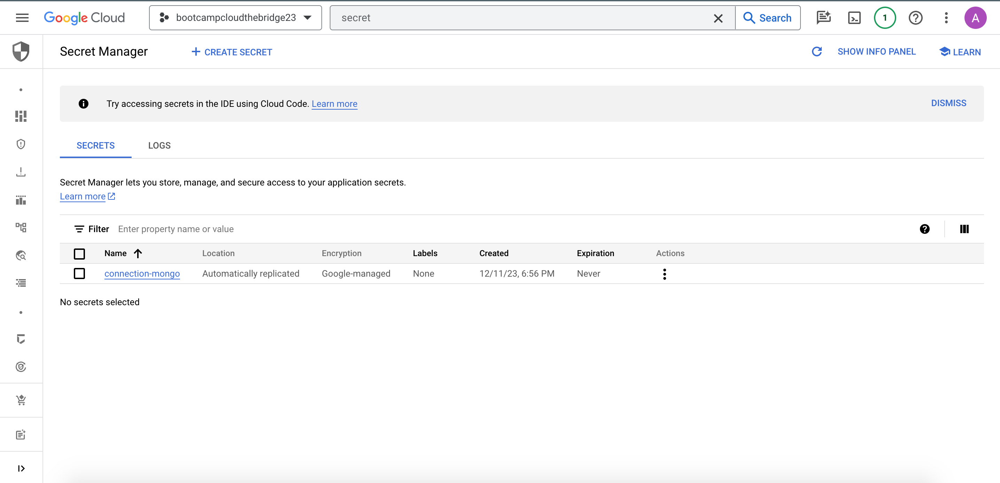
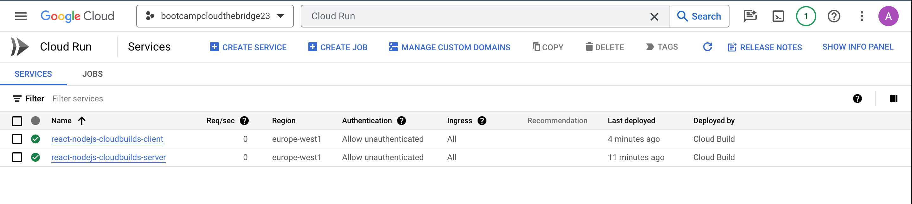

# Proyecto-React-Node-Mongo

## Planteamiento del proyecto


Desde el equipo de full-stack, nos han enviado una aplicación web desarrollada con React, Node.js y MongoDB. La arquitectura consta de un front-end (cliente) y un back-end (servidor).

Nuestra tarea consiste en implementar el despliegue de la aplicación en dos instancias de Cloud Run y asegurar la conexión entre el servidor y el cliente por un lado, y con MongoDB por el otro.

## Resolución:

### **Conectar Servidor con Base de Datos**

Una vez que hayamos creado la base de datos en MongoDB, utilizaremos Compass para establecer la conexión con nuestra instancia. Para lograr esto, es necesario que nuestro proveedor en la nube proporcione la cadena de conexión adecuada, siguiendo este formato: `mongodb+srv://<username>:<password>@cluster0.2lnyz2p.mongodb.net/`. Esta cadena contiene las credenciales de la base de datos, por lo tanto, la guardaremos como un secreto en el Secret Manager:

1. **Cadena de Conexión MongoDB:**
   - `mongodb+srv://<username>:<password>@cluster0.2lnyz2p.mongodb.net/`

2. **Almacenamiento Seguro:**
   - Guardaremos la cadena de conexión como un secreto en el Secret Manager de nuestro proveedor de servicios en la nube.




Una vez realizado este paso, procedemos a desarrollar el `cloudbuild.yaml`de la instancia *server*:

**cloudbuild_server.yaml:**

```yaml
steps:
  - name: 'gcr.io/cloud-builders/gcloud'
    args: ['config', 'set', 'project', 'rational-being-404309']

  # Build the container image
  - name: 'gcr.io/cloud-builders/docker'
    args: ['build', '-t', 'europe-west1-docker.pkg.dev/$PROJECT_ID/repo-imagenes/server-imagen:1.0', '-f', 'server/Dockerfile', '.']

  # Push the container image to Container Registry
  - name: 'gcr.io/cloud-builders/docker'
    args: ['push', 'europe-west1-docker.pkg.dev/$PROJECT_ID/repo-imagenes/server-imagen:1.0']

  # Deploy container image to Cloud Run
  - name: 'gcr.io/google.com/cloudsdktool/cloud-sdk'
    entrypoint: bash
    args: [
      "-c",
      "gcloud run deploy react-nodejs-cloudbuilds-server \
      --image=europe-west1-docker.pkg.dev/$PROJECT_ID/repo-imagenes/server-imagen:1.0 \
      --region=europe-west1 \
      --platform=managed \
      --allow-unauthenticated \
      --port=3000 \
      --update-env-vars DB_URL_ATLAS=$$DB_URL_ATLAS"
    ]

    secretEnv: [
      'DB_URL_ATLAS'
    ]

images:
  - 'europe-west1-docker.pkg.dev/$PROJECT_ID/repo-imagenes/server-imagen:1.0'

availableSecrets:
  secretManager:
    - versionName: projects/870462791430/secrets/connection-mongo/versions/latest
      env: 'DB_URL_ATLAS'
```
### Configuración del Trigger en Cloud Build

Durante la configuración del trigger en Cloud Build y al realizar un push, se despliega automáticamente una instancia del servidor. Sin embargo, nos enfrentamos a un problema al intentar establecer la conexión con la base de datos, ya que nuestro servicio Atlas no permite el acceso desde la IP específica del servidor. Este inconveniente surge debido a que las instancias en Cloud Run cuentan con una IP variable.

**Solución Propuesta:**

Para superar esta limitación, optaremos por permitir el acceso desde cualquier IP.


## Conectar Server con Client

Después de haber creado el servidor, es esencial proporcionar su URL al front-end. El cliente necesita la URL de la instancia de Cloud Run del servidor para dos operaciones críticas: la creación de usuarios y la consulta de datos. Para habilitar esta comunicación, debemos ajustar la variable `backendUrl` en los archivos `Create.jsx` y `UserDatabase.jsx` dentro de nuestra carpeta `client`. Este ajuste permitirá al front-end realizar solicitudes al back-end de manera efectiva.

**Pasos para Conectar Server con Client:**

1. **Creación del Servidor:**
   - Después de crear el servidor, es fundamental proporcionar su URL al front-end.

2. **Configuración en el Cliente:**
   - En la carpeta `client`, ubicamos los archivos `Create.jsx` y `UserDatabase.jsx`.

3. **Modificación de la Variable `backendUrl`:**
   - Dentro de los archivos mencionados, ajustamos la variable `backendUrl` para reflejar la URL de la instancia de Cloud Run del servidor.

4. **Operaciones Cruciales:**
   - Este ajuste es crucial para que el front-end pueda realizar solicitudes al back-end, especialmente en las operaciones de creación de usuarios y consulta de datos.


**Cloud Run del server con la URL necesaria:**


**Sustitución `backendUrl`:**


Con la modificación exitosa de la URL en el front-end, ahora podemos proceder a establecer un segundo trigger en Cloud Build que ejecutará el archivo `cloudbuild.yaml` correspondiente. Este paso es esencial para asegurar la sincronización entre los cambios en el código y la ejecución de las tareas definidas en el archivo de configuración.

**Triggers:**


**cloudbuild_client.yaml:**

```yaml
steps:
  - name: 'gcr.io/cloud-builders/gcloud'
    args: ['config', 'set', 'project', 'rational-being-404309']

  # Build the container image
  - name: 'gcr.io/cloud-builders/docker'
    args: ['build', '-t', 'europe-west1-docker.pkg.dev/$PROJECT_ID/repo-imagenes/client-imagen:1.0', '-f', 'client/Dockerfile', '.']

  # Push the container image to Container Registry
  - name: 'gcr.io/cloud-builders/docker'
    args: ['push', 'europe-west1-docker.pkg.dev/$PROJECT_ID/repo-imagenes/client-imagen:1.0']

  # Deploy container image to Cloud Run
  - name: 'gcr.io/google.com/cloudsdktool/cloud-sdk'
    entrypoint: bash
    args: [
      "-c",
      "gcloud run deploy react-nodejs-cloudbuilds-client 
      --image=europe-west1-docker.pkg.dev/$PROJECT_ID/repo-imagenes/client-imagen:1.0 
      --region=europe-west1 
      --platform=managed 
      --allow-unauthenticated 
      --port=5173"
    ]

images:
  - 'europe-west1-docker.pkg.dev/$PROJECT_ID/repo-imagenes/client-imagen:1.0'
```

**Cloud Builds ejecutadas satisfactoriamente:**


**Cloud Runs funcionando para el *server* y el *client*:**



Ya podemos visualizar en front-end, interactuar con él, y el back-end funcionando y conectado a la base de datos de mongoDB. Tenemos nuestra aplicación web funcionando correctamente.


